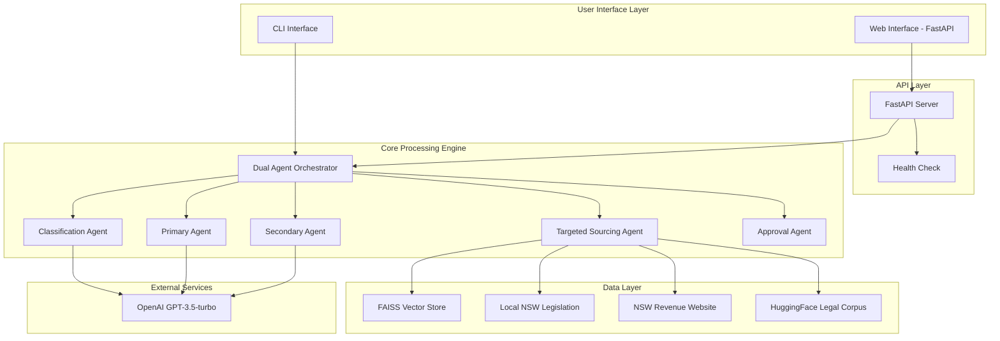
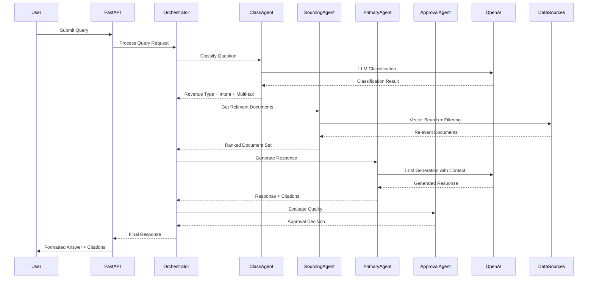
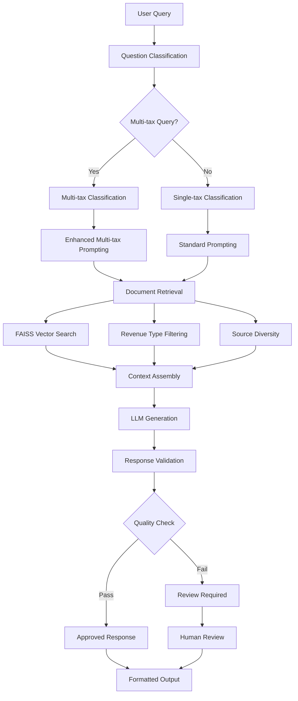
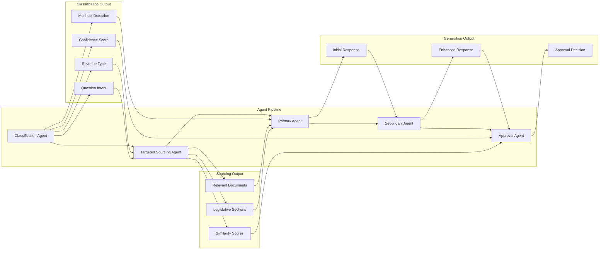
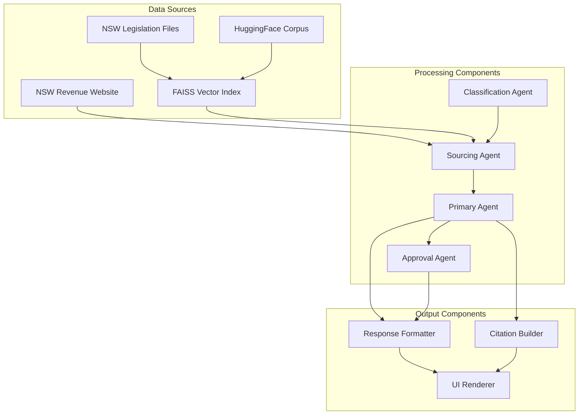
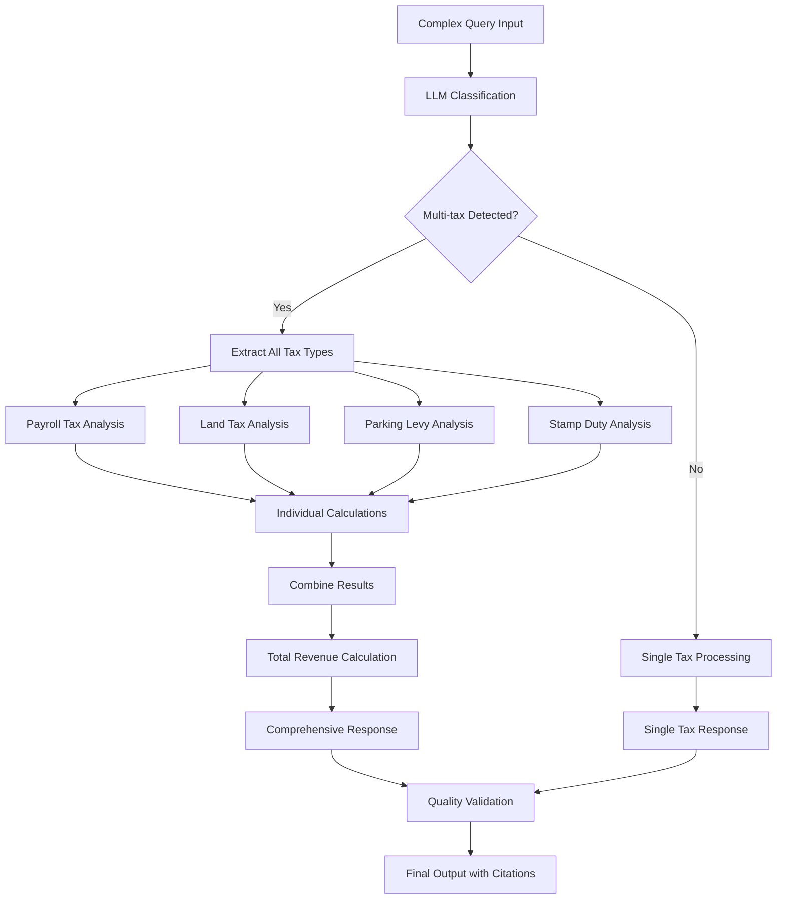
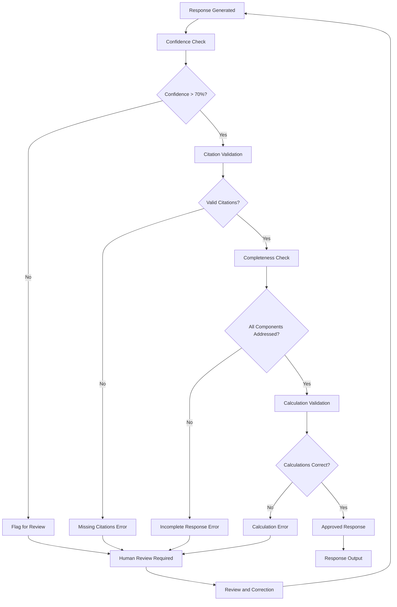
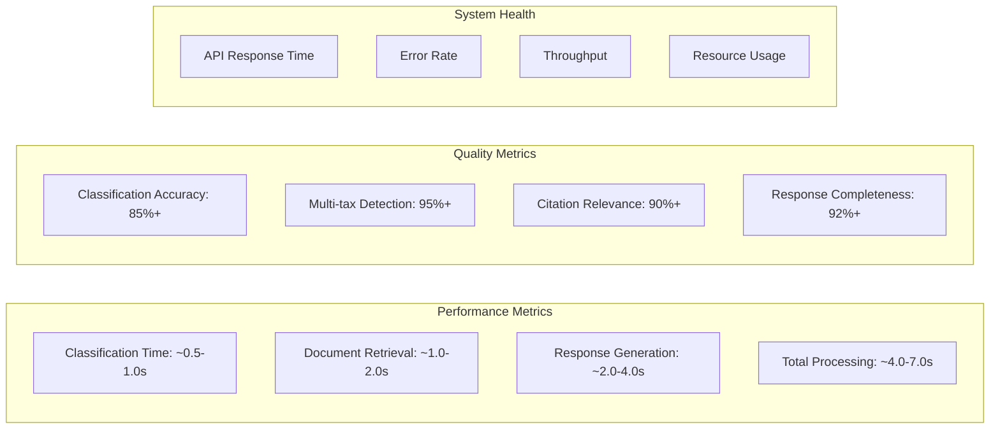
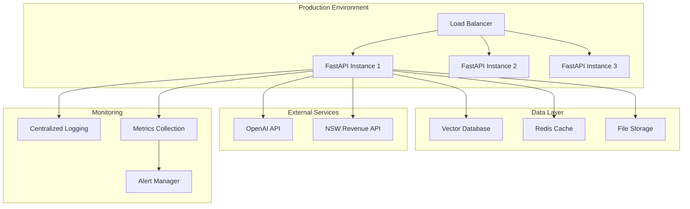
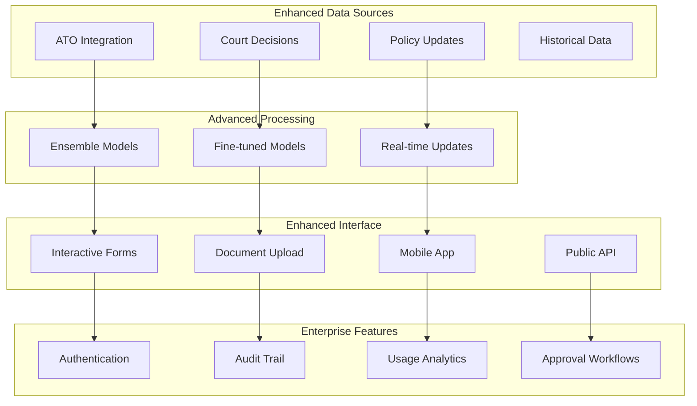

# NSW Revenue AI Assistant - Architecture Diagrams

## System Architecture Overview

## Data Flow Architecture

## RAG Implementation Flow

## Multi-Agent Coordination

## Component Interaction Matrix

## Multi-Tax Processing Flow

## Error Handling and Validation Flow

## System Performance Monitoring

## Deployment Architecture

## Future Enhancement Architecture

