# NSW Revenue AI Assistant - Pipeline Flow Diagram

## 🔄 **Current Question Processing Pipeline**


## 🚨 **IDENTIFIED PIPELINE ISSUES**

### **1. Weak Source Context Formatting**
**Current Issue:** Sources are converted to generic format, losing specificity
```python
# Current - WEAK
formatted_source = {
    'act_name': source.act_name or source.title,
    'content': source.content,
    'similarity_score': source.relevance_score,
    'source': source.source_type
}
```

**Should be:** Structured with clear citations and highlighted passages

### **2. Low Confidence Scores (0.48)**
**Root Cause:** LLM receives generic source data without:
- Specific section references
- Highlighted relevant passages
- Clear legislative citations
- Structured fact presentation

### **3. Missing Fact Extraction Pipeline**
**Current:** Raw text goes to LLM
**Needed:** Pre-extract key facts (rates, thresholds, amounts) before LLM processing

## 💡 **IMPROVED PIPELINE DESIGN**

```mermaid
flowchart TD
    A[User Question] --> B[Classification Agent]
    B --> C[Search Terms + Entities]
    C --> D[Targeted Sourcing]

    D --> E[Source Discovery]
    E --> F[🔍 FACT EXTRACTION LAYER]

    F --> F1[Extract Tax Rates]
    F --> F2[Extract Thresholds]
    F --> F3[Extract Key Sections]
    F --> F4[Highlight Relevant Text]

    F1 --> G[Structured Source Package]
    F2 --> G
    F3 --> G
    F4 --> G

    G --> H[🎯 CITATION-FOCUSED PROMPT]
    H --> I[LLM with Structured Context]
    I --> J[Response with Clear Citations]
    J --> K[Enhanced UI Formatting]
    K --> L[Professional Display]
```



## 🎯 **REQUIRED FIXES**

### **Fix 1: Structured Source Formatting**
Instead of raw content, provide:
```
PAYROLL TAX CALCULATION REQUEST

LEGISLATIVE AUTHORITY:
- Payroll Tax Act 2007, Section 15: "Rate of payroll tax: 5.45%"
- Payroll Tax Act 2007, Section 5: "Tax-free threshold: $1,200,000"

USER SITUATION:
- Wages: $323,000
- Multiple businesses: 3 entities
- ANALYSIS: $323k < $1.2M threshold = $0 tax owed

REQUIRED RESPONSE FORMAT:
1. Direct calculation result
2. Cite specific sections used
3. Show calculation steps
```

### **Fix 2: Fact Extraction Before LLM**
Pre-process sources to extract:
- Tax rates (5.45%)
- Thresholds ($1,200,000)
- Calculation formulas
- Due dates
- Exemptions

### **Fix 3: Citation-Focused Prompting**
Current prompt is generic. Need:
```
You are a NSW Revenue tax specialist. Provide:
1. DIRECT ANSWER with calculation
2. CITE specific Act sections used
3. SHOW your working
4. FORMAT with clear structure

Example response:
"CALCULATION: $0 payroll tax owed
REASON: $323,000 wages < $1,200,000 threshold
AUTHORITY: Payroll Tax Act 2007, Section 5 (threshold), Section 15 (rate)"
```

## 📋 **IMPLEMENTATION PRIORITY**

1. **HIGH**: Fix source formatting to include structured facts
2. **HIGH**: Update LLM prompt for citation-focused responses
3. **MEDIUM**: Add fact extraction preprocessing
4. **LOW**: Enhanced UI (already implemented by UX agent)

The core issue is that the LLM receives unstructured source data and lacks clear instructions to provide factual, citation-heavy responses.