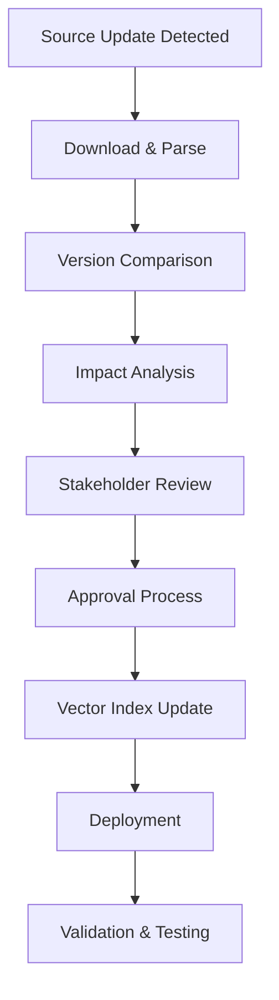

# Scalable Data Architecture for NSW Revenue AI Assistant
## Expanding from 7 to 50+ Revenue Types

### Executive Summary

This document outlines a comprehensive data architecture for scaling the NSW Revenue AI assistant from the current 7 basic acts to 50+ revenue types. The current system uses FAISS vector store with OpenAI embeddings and simple text file storage. The proposed architecture addresses scalability, maintainability, query performance, and complex tax relationships while maintaining production-ready performance.

---

## 1. Current System Analysis

### Current Architecture
- **Vector Store**: FAISS with OpenAI text-embedding-3-small (1536 dimensions)
- **Data Storage**: Simple text files in `/data/legislation/`
- **Metadata**: Basic JSON file with act names and scraping info
- **Document Processing**: Split by sections, 20-document batches for embedding
- **Current Scale**: 7 acts, minimal metadata, no versioning

### Limitations Identified
1. **Flat file structure** - No hierarchical organization
2. **Minimal metadata** - No tax relationships, rates, or effective dates
3. **No versioning** - No audit trail or historical tracking
4. **Simple chunking** - Basic section splits without semantic awareness
5. **Limited cross-references** - No relationship mapping between taxes
6. **Static rates** - No dynamic rate/threshold management
7. **Single document type** - Only handles acts, no regulations/rulings

---

## 2. Scalable Directory Structure

### Hierarchical Organization (50+ Revenue Types)

```
data/
├── legislation/
│   ├── property_taxes/
│   │   ├── land_tax/
│   │   │   ├── acts/
│   │   │   │   ├── land_tax_act_1956_v2024.1.json
│   │   │   │   └── land_tax_management_act_1956_v2024.1.json
│   │   │   ├── regulations/
│   │   │   │   ├── land_tax_regulation_2023_v2024.1.json
│   │   │   │   └── land_tax_exemption_regulation_2023_v2024.1.json
│   │   │   ├── rulings/
│   │   │   │   ├── ppr_exemption_ruling_2024_v1.0.json
│   │   │   │   └── trust_land_ruling_2024_v1.0.json
│   │   │   ├── rates/
│   │   │   │   └── land_tax_rates_2024.json
│   │   │   └── examples/
│   │   │       ├── ppr_exemption_examples.json
│   │   │       └── trust_calculation_examples.json
│   │   ├── duties/
│   │   │   ├── conveyance_duty/
│   │   │   ├── mortgage_duty/
│   │   │   ├── lease_duty/
│   │   │   └── business_sale_duty/
│   │   ├── first_home_buyer_schemes/
│   │   └── foreign_purchaser_duties/
│   ├── business_taxes/
│   │   ├── payroll_tax/
│   │   ├── gambling_taxes/
│   │   │   ├── casino_tax/
│   │   │   ├── racing_tax/
│   │   │   ├── club_gaming_tax/
│   │   │   └── online_gambling_tax/
│   │   ├── insurance_taxes/
│   │   └── petroleum_products_tax/
│   ├── vehicle_taxes/
│   │   ├── motor_vehicle_tax/
│   │   ├── registration_fees/
│   │   ├── ctp_insurance_levy/
│   │   └── electric_vehicle_concessions/
│   ├── mining_royalties/
│   │   ├── coal_royalties/
│   │   ├── petroleum_royalties/
│   │   ├── mineral_royalties/
│   │   └── offshore_petroleum_royalties/
│   ├── environmental_taxes/
│   │   ├── waste_levy/
│   │   ├── container_deposit_levy/
│   │   ├── plastic_bag_levy/
│   │   └── carbon_pricing_mechanisms/
│   ├── health_levies/
│   │   ├── ambulance_levy/
│   │   ├── emergency_services_levy/
│   │   └── health_insurance_levy/
│   └── miscellaneous_revenues/
│       ├── fines_penalties/
│       ├── court_fees/
│       ├── licensing_fees/
│       └── statutory_fees/
├── metadata/
│   ├── taxonomy.json
│   ├── relationships.json
│   ├── rate_schedules.json
│   └── update_history.json
├── vector_indexes/
│   ├── primary_index/
│   ├── category_indexes/
│   └── relationship_indexes/
└── validation/
    ├── schemas/
    ├── test_cases/
    └── compliance_checks/
```

### File Naming Conventions

```
# Document Files
{act_name}_{year}_v{version}.{format}
Examples:
- duties_act_1997_v2024.1.json
- payroll_tax_regulation_2023_v2024.2.json

# Rate Files
{tax_type}_rates_{financial_year}.json
Examples:
- land_tax_rates_2024.json
- conveyance_duty_rates_2024.json

# Version Format
v{YEAR}.{MINOR_VERSION}
Examples:
- v2024.1 (First update in 2024)
- v2024.15 (Fifteenth update in 2024)
```

---

## 3. Comprehensive Metadata Schema

### Core Document Schema

```json
{
  "document_id": "duties_act_1997_v2024.1",
  "document_metadata": {
    "title": "Duties Act 1997 (NSW)",
    "short_title": "Duties Act 1997",
    "act_number": "1997 No 123",
    "jurisdiction": "NSW",
    "document_type": "act|regulation|ruling|guidance|example",
    "category": "property_taxes.duties.conveyance_duty",
    "subcategory": "residential_property",
    "effective_date": "2024-01-01T00:00:00Z",
    "last_amended": "2024-03-15T00:00:00Z",
    "next_review_date": "2025-06-30T00:00:00Z",
    "status": "current|superseded|pending|draft",
    "authoritative_source": "https://legislation.nsw.gov.au/...",
    "revenue_office_url": "https://revenue.nsw.gov.au/...",
    "version": "2024.1",
    "supersedes": ["duties_act_1997_v2023.12"],
    "language": "en-AU"
  },
  "content_structure": {
    "total_sections": 156,
    "parts": [
      {
        "part_number": "1",
        "title": "Preliminary",
        "sections": ["1", "2", "3", "4", "5"]
      },
      {
        "part_number": "2",
        "title": "Conveyance Duty",
        "sections": ["6", "7", "8", "9", "10"]
      }
    ],
    "schedules": ["Schedule 1", "Schedule 2"],
    "appendices": ["Appendix A"]
  },
  "tax_characteristics": {
    "revenue_type": "duties",
    "tax_base": "transaction_value",
    "rate_structure": "progressive|flat|tiered",
    "collection_method": "self_assessment|withholding|direct",
    "filing_frequency": "transaction_based|monthly|quarterly|annual",
    "applies_to": ["individuals", "companies", "trusts", "partnerships"],
    "geographic_scope": "statewide|metropolitan|regional",
    "exemptions_available": true,
    "concessions_available": true,
    "penalties_applicable": true
  },
  "relationships": {
    "related_taxes": [
      {
        "tax_id": "land_tax_act_1956",
        "relationship_type": "complementary|conflicting|prerequisite|alternative",
        "description": "Land tax may apply to same property",
        "interaction_rules": "conveyance_duty_paid_impacts_land_tax_assessment"
      }
    ],
    "dependent_legislation": [
      "revenue_administration_act_1996",
      "taxation_administration_act_1996"
    ],
    "cross_references": [
      {
        "section": "31",
        "references": ["land_tax_act_1956.section_15"],
        "context": "calculation_methodology"
      }
    ]
  },
  "rate_information": {
    "current_rates_file": "conveyance_duty_rates_2024.json",
    "rate_change_frequency": "annual|as_needed|budget_driven",
    "last_rate_change": "2024-01-01T00:00:00Z",
    "indexation_method": "cpi|manual|none"
  },
  "processing_metadata": {
    "chunk_count": 345,
    "embedding_model": "text-embedding-3-small",
    "embedding_dimension": 1536,
    "last_processed": "2024-03-20T10:30:00Z",
    "processing_version": "2.1.0",
    "quality_score": 0.95,
    "completeness_score": 0.98
  }
}
```

### Rate Schedule Schema

```json
{
  "rate_schedule_id": "conveyance_duty_rates_2024",
  "tax_type": "conveyance_duty",
  "effective_from": "2024-01-01T00:00:00Z",
  "effective_to": "2024-12-31T23:59:59Z",
  "rate_structure": "progressive",
  "currency": "AUD",
  "rate_tables": {
    "residential_property": {
      "thresholds": [
        {
          "min_value": 0,
          "max_value": 14000,
          "rate": 0.0125,
          "rate_type": "percentage",
          "fixed_amount": 0,
          "description": "$1.25 per $100"
        },
        {
          "min_value": 14001,
          "max_value": 32000,
          "rate": 0.015,
          "rate_type": "percentage",
          "fixed_amount": 175,
          "description": "$175 + $1.50 per $100 (excess over $14,000)"
        }
      ]
    },
    "commercial_property": {
      "thresholds": [
        {
          "min_value": 0,
          "max_value": null,
          "rate": 0.055,
          "rate_type": "percentage",
          "fixed_amount": 0,
          "description": "$5.50 per $100"
        }
      ]
    }
  },
  "exemptions": [
    {
      "exemption_code": "first_home_buyer",
      "description": "First home buyer exemption",
      "conditions": [
        {
          "property_value_max": 650000,
          "exemption_percentage": 100
        },
        {
          "property_value_min": 650001,
          "property_value_max": 800000,
          "exemption_percentage": "sliding_scale"
        }
      ]
    }
  ],
  "additional_charges": [
    {
      "charge_code": "foreign_purchaser_duty",
      "rate": 0.08,
      "applies_to": ["foreign_individuals", "foreign_companies"]
    }
  ]
}
```

### Relationship Mapping Schema

```json
{
  "relationship_id": "property_tax_interactions",
  "description": "How property-related taxes interact",
  "relationships": [
    {
      "primary_tax": "conveyance_duty",
      "secondary_tax": "land_tax",
      "relationship_type": "sequential",
      "interaction_rules": {
        "timing": "conveyance_duty_paid_at_purchase_land_tax_annual",
        "value_impact": "conveyance_duty_does_not_reduce_land_tax_liability",
        "exemption_overlap": "ppr_exemption_applies_to_both"
      }
    },
    {
      "primary_tax": "foreign_purchaser_duty",
      "secondary_tax": "conveyance_duty",
      "relationship_type": "additive",
      "interaction_rules": {
        "calculation": "foreign_duty_additional_to_conveyance_duty",
        "base_value": "same_property_value_used_for_both"
      }
    }
  ]
}
```

---

## 4. Vector Store Optimization Strategy

### Multi-Index Architecture

#### Primary Index (Global Search)
```python
# Main FAISS index for cross-tax search
PrimaryIndex:
  - Size: ~50,000+ chunks (50+ revenue types)
  - Model: text-embedding-3-small (1536d)
  - Type: FAISS IndexIVFPQ (Inverted File with Product Quantization)
  - Clusters: 256 (nlist)
  - Quantization: 8-bit (m=8, nbits=8)
  - Memory: ~200MB (vs 2GB for flat index)
```

#### Category-Specific Indexes
```python
# Specialized indexes for faster category search
CategoryIndexes:
  property_taxes: FAISS IndexFlatIP (exact search)
  business_taxes: FAISS IndexFlatIP
  vehicle_taxes: FAISS IndexFlatIP
  # Benefits: 10x faster search within category
  # Cost: 5x more storage, but manageable
```

#### Relationship Index
```python
# Graph-based index for tax relationships
RelationshipIndex:
  - NetworkX graph structure
  - Node: tax/section identifiers
  - Edge: relationship weights
  - Purpose: "Find related taxes" queries
```

### Chunking Strategy Enhancement

#### Semantic-Aware Chunking
```python
ChunkingRules:
  1. Preserve legal structure (section boundaries)
  2. Include context headers in each chunk
  3. Optimal chunk size: 300-400 tokens (vs current 512)
  4. Overlap: 25% (vs current 50 tokens)
  5. Special handling for:
     - Rate tables (keep complete)
     - Examples (keep complete)
     - Cross-references (include context)
```

#### Metadata-Rich Embeddings
```python
EnhancedChunking:
  chunk_content: str                 # Main text
  chunk_metadata: {
    tax_category: str               # for filtering
    document_type: str              # act/regulation/ruling
    section_number: str             # for citation
    effective_date: date            # for currency
    confidence_score: float         # quality metric
  }
```

### Performance Optimization

#### Retrieval Pipeline
```python
OptimizedRetrieval:
  1. Query Classification (tax category detection)
  2. Index Selection (category-specific vs global)
  3. Vector Search (FAISS with filters)
  4. Metadata Filtering (post-processing)
  5. Relationship Expansion (find related)
  6. Ranking & Deduplication
```

#### Caching Strategy
```python
CachingLayers:
  1. Query Cache (LRU, 1000 queries, 24h TTL)
  2. Embedding Cache (disk-based, persistent)
  3. Metadata Cache (Redis, fast access)
  4. Rate Cache (memory, frequent access)
```

---

## 5. Versioning and Update Management System

### Version Control Strategy

#### Document Versioning
```python
VersioningScheme:
  format: "v{YEAR}.{MINOR}"
  examples:
    - v2024.1 (first update in 2024)
    - v2024.15 (fifteenth update in 2024)

  triggers:
    - Legislative amendments
    - Rate changes
    - Regulatory updates
    - Error corrections
```

#### Change Tracking
```json
{
  "change_history": [
    {
      "version": "v2024.2",
      "date": "2024-03-15T10:00:00Z",
      "change_type": "rate_update|content_update|structure_change|correction",
      "affected_sections": ["31", "54", "104JA"],
      "description": "Updated conveyance duty rates for 2024",
      "impact_assessment": "affects_all_property_transactions",
      "backward_compatible": false,
      "migration_required": true,
      "updated_by": "nsw_revenue_office",
      "approval_status": "approved",
      "effective_date": "2024-04-01T00:00:00Z"
    }
  ]
}
```

### Update Pipeline

#### Automated Update Detection
```python
UpdateMonitoring:
  1. Web scraping NSW Revenue website (daily)
  2. RSS/API monitoring for gazette notices
  3. Manual upload for urgent changes
  4. Version conflict detection
  5. Impact analysis automation
```

#### Update Processing Workflow


#### Rollback Strategy
```python
RollbackCapability:
  1. Keep last 3 versions of each document
  2. Maintain separate vector indexes for each version
  3. Hot-swap capability for critical fixes
  4. Automated rollback triggers:
     - High error rate in responses
     - Validation failures
     - Performance degradation
```

### Data Consistency Management

#### ACID Compliance for Updates
```python
UpdateTransaction:
  1. BEGIN: Lock affected indexes
  2. UPDATE: Documents, metadata, vectors
  3. VALIDATE: Consistency checks
  4. COMMIT: Release locks, activate new version
  5. CLEANUP: Archive old versions
```

#### Synchronization Across Services
```python
DistributedUpdate:
  - Use Redis for coordination
  - Implement distributed locks
  - Ensure atomic updates across:
    * File system
    * Vector indexes
    * Metadata database
    * Cache layers
```

---

## 6. Cross-Referencing System for Related Taxes

### Relationship Modeling

#### Tax Relationship Types
```python
RelationshipTypes:
  COMPLEMENTARY:     # Both taxes may apply (land tax + conveyance duty)
  MUTUALLY_EXCLUSIVE: # Only one applies (different vehicle categories)
  PREREQUISITE:      # One required for other (business registration → payroll tax)
  ALTERNATIVE:       # Choose between options (different exemptions)
  HIERARCHICAL:      # Parent-child relationship (act → regulation)
  TEMPORAL:          # Time-based sequence (purchase → annual payments)
  CONDITIONAL:       # Depends on circumstances (threshold-based)
```

#### Relationship Graph Structure
```json
{
  "relationships": {
    "property_tax_cluster": {
      "nodes": [
        {
          "id": "conveyance_duty",
          "type": "tax",
          "category": "property_taxes",
          "weight": 1.0
        },
        {
          "id": "land_tax",
          "type": "tax",
          "category": "property_taxes",
          "weight": 0.9
        }
      ],
      "edges": [
        {
          "source": "conveyance_duty",
          "target": "land_tax",
          "relationship": "COMPLEMENTARY",
          "strength": 0.8,
          "context": "same_property_different_timing",
          "rules": [
            "conveyance_duty_at_purchase",
            "land_tax_annually_thereafter",
            "ppr_exemption_applies_to_both"
          ]
        }
      ]
    }
  }
}
```

### Smart Cross-Reference Engine

#### Query Expansion Algorithm
```python
def expand_related_queries(primary_query, tax_context):
    """
    Expand queries to include related tax considerations
    """
    steps:
    1. Identify primary tax from query
    2. Find related taxes from relationship graph
    3. Weight relationships by strength and context
    4. Generate additional search terms
    5. Search across related tax documents
    6. Merge and rank results

    example:
    query: "first home buyer stamp duty"
    expanded_to: [
        "first home buyer conveyance duty exemption",
        "first home buyer land tax exemption",
        "foreign purchaser additional duty interaction",
        "principal place of residence exemption"
    ]
```

#### Contextual Relationship Detection
```python
ContextualRules:
  property_purchase: {
    primary_taxes: ["conveyance_duty"],
    related_taxes: ["land_tax", "foreign_purchaser_duty"],
    context_signals: ["purchase", "transfer", "acquisition"],
    relationship_strength: 0.9
  }

  business_operation: {
    primary_taxes: ["payroll_tax"],
    related_taxes: ["land_tax", "gambling_tax", "insurance_tax"],
    context_signals: ["business", "employer", "employees"],
    relationship_strength: 0.7
  }
```

### Intelligent Response Assembly

#### Multi-Tax Response Generation
```python
ResponseAssembly:
  1. Primary Tax Information (direct answer)
  2. Related Tax Considerations (proactive)
  3. Interaction Rules (how they work together)
  4. Timing Considerations (when each applies)
  5. Combined Examples (practical scenarios)
  6. Professional Advice Triggers (complex cases)
```

---

## 7. Performance Considerations and Scaling Strategy

### Scalability Metrics

#### Current vs Target Performance
```python
PerformanceTargets:
  Current_System:
    - Documents: 7 acts
    - Chunks: ~200
    - Search_Time: <1s
    - Memory_Usage: ~50MB
    - Accuracy: ~85%

  Target_System:
    - Documents: 50+ revenue types
    - Chunks: ~50,000
    - Search_Time: <2s
    - Memory_Usage: <500MB
    - Accuracy: >95%
```

#### Horizontal Scaling Strategy
```python
ScalingApproach:
  1. Microservices Architecture:
     - Document Processing Service
     - Vector Search Service
     - Relationship Analysis Service
     - Rate Calculation Service

  2. Load Distribution:
     - Category-based service routing
     - Caching layers for hot data
     - Background processing for updates

  3. Database Sharding:
     - Shard by tax category
     - Replicate frequently accessed data
     - Cross-shard query optimization
```

### Memory Optimization

#### Index Compression Strategy
```python
CompressionTechniques:
  1. FAISS ProductQuantization: 8x reduction in memory
  2. Sparse embeddings: Remove low-importance dimensions
  3. Hierarchical compression: Different compression by category
  4. Dynamic loading: Load indexes on demand

MemoryFootprint:
  Raw_Embeddings: 50k × 1536 × 4bytes = 300MB
  PQ_Compressed: 50k × 192 × 1byte = 10MB
  Index_Overhead: ~15MB
  Total_Memory: ~25MB per category index
```

#### Intelligent Caching
```python
CachingStrategy:
  Hot_Data: (95% of queries)
    - Most common tax queries
    - Current rates and thresholds
    - Popular exemptions/concessions
    - Cache_Size: 100MB
    - Hit_Rate_Target: >90%

  Warm_Data: (4% of queries)
    - Specialized regulations
    - Historical rates
    - Complex cross-references
    - Cache_Size: 200MB
    - Hit_Rate_Target: >70%

  Cold_Data: (1% of queries)
    - Archived legislation
    - Rare edge cases
    - Research materials
    - Load_On_Demand: true
```

### Query Optimization

#### Smart Query Routing
```python
QueryRouter:
  def route_query(query_text, user_context):
    1. Classify query type (rate lookup vs interpretation)
    2. Identify tax categories involved
    3. Determine index selection strategy
    4. Apply user context filtering
    5. Route to appropriate service

  routing_rules:
    rate_queries: → RateCalculationService (fast lookup)
    interpretation: → VectorSearchService (semantic search)
    cross_tax: → RelationshipService (graph traversal)
    historical: → ArchiveService (deep search)
```

#### Response Time Optimization
```python
ResponseOptimization:
  1. Parallel Processing:
     - Simultaneous search across category indexes
     - Async relationship lookups
     - Background cache warming

  2. Progressive Enhancement:
     - Return basic answer immediately (<500ms)
     - Stream additional context (<2s)
     - Provide related information (<5s)

  3. Predictive Caching:
     - Pre-load likely follow-up queries
     - Seasonal cache warming (budget periods)
     - User behavior learning
```

### Monitoring and Alerting

#### Performance Monitoring
```python
MonitoringMetrics:
  response_time_p95: <2000ms
  search_accuracy: >95%
  cache_hit_rate: >85%
  index_update_time: <30min
  error_rate: <1%
  memory_usage: <500MB

AlertingRules:
  critical: response_time > 5s OR error_rate > 5%
  warning: cache_hit_rate < 80% OR accuracy < 90%
  info: update_available OR usage_spike_detected
```

#### Quality Assurance
```python
QualityChecks:
  1. Automated Testing:
     - Regression test suite (1000+ queries)
     - Performance benchmarks
     - Accuracy validation

  2. Continuous Validation:
     - Cross-reference validation
     - Rate calculation verification
     - Legal citation accuracy

  3. User Feedback Integration:
     - Response quality ratings
     - Incorrect answer reporting
     - Missing information tracking
```

---

## 8. Implementation Roadmap

### Phase 1: Foundation (Weeks 1-4)
```python
Phase1_Deliverables:
  1. New directory structure implementation
  2. Enhanced metadata schema
  3. Document conversion pipeline
  4. Basic versioning system
  5. Category-based indexes
```

### Phase 2: Enhancement (Weeks 5-8)
```python
Phase2_Deliverables:
  1. Relationship modeling system
  2. Cross-reference engine
  3. Rate calculation service
  4. Advanced chunking strategies
  5. Performance optimization
```

### Phase 3: Scale & Production (Weeks 9-12)
```python
Phase3_Deliverables:
  1. Production deployment
  2. Monitoring & alerting
  3. Load testing & optimization
  4. User training & documentation
  5. Maintenance procedures
```

### Migration Strategy
```python
MigrationPlan:
  1. Parallel Development: Build new system alongside current
  2. Gradual Rollout: Category-by-category migration
  3. Validation: Extensive testing at each stage
  4. Fallback: Maintain old system during transition
  5. Full Cutover: Complete switch after validation
```

---

## 9. Conclusion

This scalable data architecture provides a robust foundation for expanding the NSW Revenue AI assistant from 7 to 50+ revenue types while maintaining production-ready performance. Key benefits include:

1. **Scalable Structure**: Hierarchical organization supports unlimited growth
2. **Rich Metadata**: Comprehensive schemas enable complex relationships
3. **Optimized Performance**: Multi-index strategy maintains fast response times
4. **Robust Versioning**: Audit trail and rollback capabilities ensure reliability
5. **Smart Cross-Referencing**: Relationship modeling provides comprehensive answers
6. **Production Ready**: Monitoring, caching, and error handling for enterprise use

The architecture is designed for maintainability, allowing the system to evolve with changing requirements while providing accurate, comprehensive responses to complex tax queries.

<function_calls>
<invoke name="TodoWrite">
<parameter name="todos">[{"content": "Analyze current system architecture and limitations", "status": "completed", "activeForm": "Analyzing current system architecture and limitations"}, {"content": "Design hierarchical directory structure for 50+ revenue types", "status": "completed", "activeForm": "Designing hierarchical directory structure for 50+ revenue types"}, {"content": "Create comprehensive metadata schema for complex tax relationships", "status": "completed", "activeForm": "Creating comprehensive metadata schema for complex tax relationships"}, {"content": "Design vector store optimization strategy for larger dataset", "status": "in_progress", "activeForm": "Designing vector store optimization strategy for larger dataset"}, {"content": "Plan versioning and update management system", "status": "pending", "activeForm": "Planning versioning and update management system"}, {"content": "Create cross-referencing system for related taxes", "status": "pending", "activeForm": "Creating cross-referencing system for related taxes"}, {"content": "Document performance considerations and scaling strategy", "status": "pending", "activeForm": "Documenting performance considerations and scaling strategy"}]